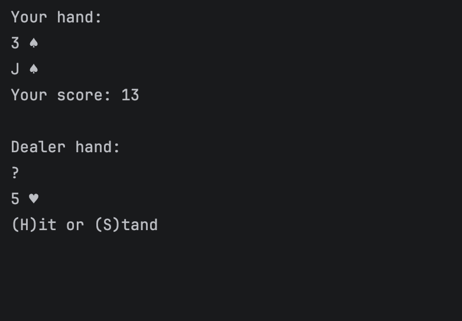
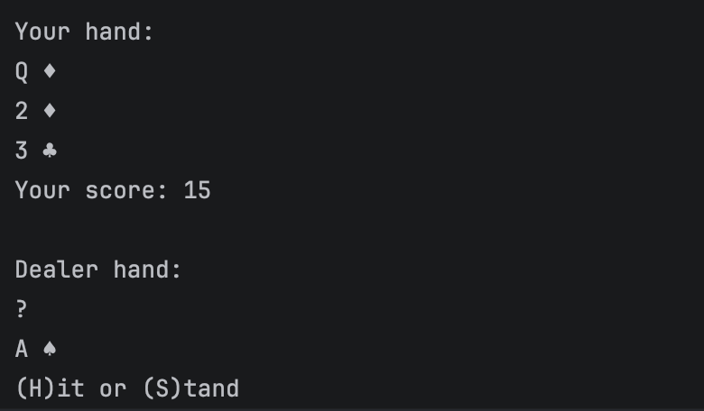

# Blackjack

A terminal-based Blackjack game built in Python using Object-Oriented Programming concepts. The game simulates a classic Blackjack experience with a player, dealer, deck of cards, scoring system, and win conditions.

## About

This project was created to practice and apply Object-Oriented Programming concepts in Python. Unlike my earlier projects that focused mainly on procedural programming, this implementation uses classes and objects to structure the game logic.

The project models real-world components of Blackjack, including cards, decks, players, dealers, and the overall game flow.

## Features

* Complete 52-card deck generation
* Card and deck management using classes
* Player and dealer system
* Card shuffling and dealing
* Blackjack detection
* Dynamic score calculation with Ace handling
* Player choices:

  * Hit
  * Stand
* Dealer logic to draw cards until reaching 17 or higher
* Automatic winner determination
* Terminal-based gameplay experience

## Gameplay Preview

### Initial Deal

### Player Turn

### Final Result

## What I Learned

Through this project, I practiced:

* Creating and using classes and objects
* Implementing inheritance
* Designing programs using OOP principles
* Managing object states
* Creating relationships between different classes
* Using lists and dictionaries to store data
* Implementing game loops and conditions
* Handling complex logic such as Blackjack scoring and Ace values

## Future Improvements

Possible improvements for future versions:

* Add replay functionality
* Add betting and chip system
* Add multiple players
* Split code into separate modules
* Create a graphical user interface (GUI)

## Author

**Yatin Thota**
